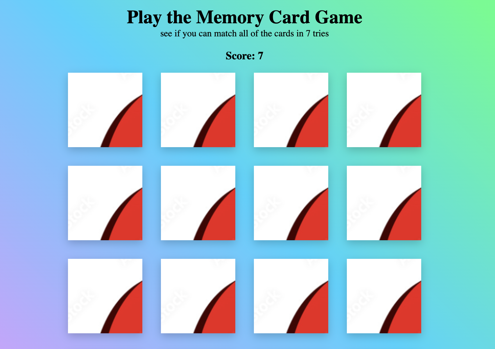

# Memory Game
Test your muscle memory and see if you can match all of the cards in under seven tries. 

## Link to Project:
https://testmymemory.netlify.app/

## How It's Made:

**Tech used:** HTML, CSS, JavaScript

## Examples:
Take a look at these couple examples that I have in my own portfolio:

**BMI Calc:** https://github.com/amunoali/bmiCalc

**Portfolio:** https://github.com/amunoali/portfolio

**Simon Game:** https://github.com/amunoali/simonGame

